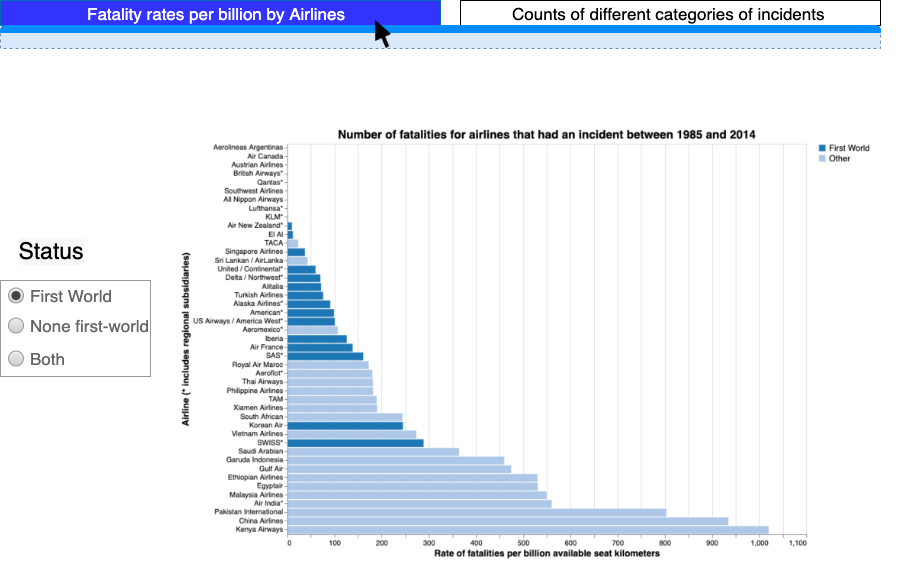
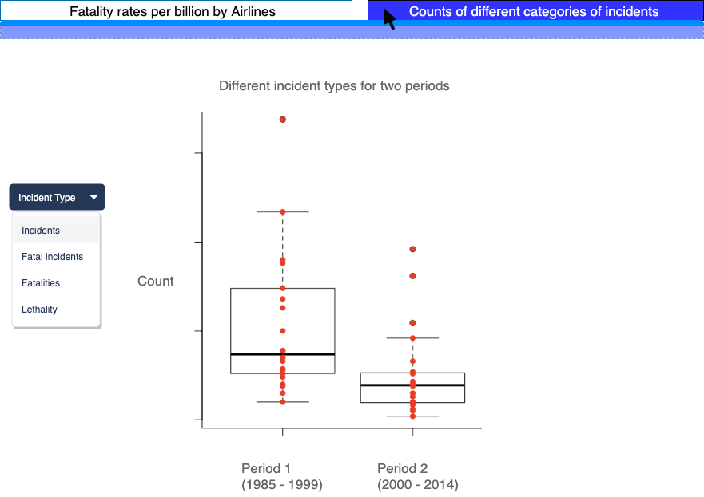

# FLIGHT EXPLORER

Flight safety is often an important issue. Airlines are financially affected by plane malfunctions, since travellers often will pick an airline based on its record of safety, and a particularly bad incident will leave a bad reputation, regardless of improvements. In addition, various agencies would like to collect data about air safety, in order to discover any trends or patterns involved with air accidents.

Flight Explorer is a dashboard that visualizes airline flight data with regards to flight incidents at different airlines, and displays them by airlines, incident numbers, as well as other factors such as first-world status of originating airlines, and lethality of air incidents.

## Contributions

We welcome all contributions to this project! If you notice a bug, or have a feature request, please open up an issue [here](https://github.com/UBC-MDS/DSCI_532_GROUP_111_FLIGHT_EXPLORER/issues). If you'd like to contribute a feature or bug fix, you can fork our repo and submit a pull request. We will review pull requests within 7 days. All contributors must abide by our [code of conduct](https://github.com/UBC-MDS/DSCI_532_GROUP_111_FLIGHT_EXPLORER/blob/master/CODE_OF_CONDUCT.md).
